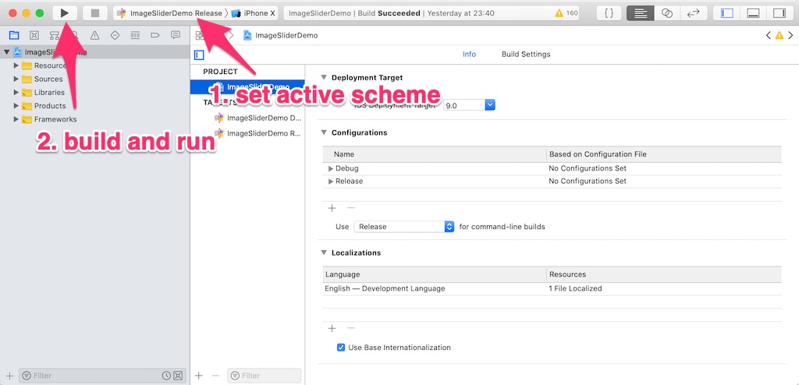

# ARDemo project

This is a test project used for testing and development of [`react-native-magic-script`](https://github.com/magic-script/react-native-magic-script) module.

## Prerequisites

1. In order to run this project, you need to have React Native installed. Please follow [this link](https://facebook.github.io/react-native/docs/getting-started.html) to install React Native on your machine.

2. Make sure you have the [`react-native-magic-script`](https://github.com/magic-script/react-native-magic-script) module cloned to the same folder as this repo. Right now the `react-native-magic-script` module is locally linked with this project (see the value of `dependencies/react-native-magic-script` in `/ARDemo/package.json` file).

3. Install the required packages.

     - NOTE: `npm install` does not work at the moment! Please use `yarn` instead.
     - Call `yarn` from the main app folder (`./ARDemo`).

## Running the demo app (iOS)

1. Run iOS project in Xcode:

     - Open iOS project at `./ARDemo/ios/ARDemo.xcodeproj` in Xcode.
     - Select **ARDemo Release** as the active scheme. **ARDemo Debug** also works, but you will need the Metro Boundler running during the app run (e.g. if you unplug your device from the computer, the app will close and won't work as a standalone app).
     - Run the app by pressing `Cmd+Shift+R` or by pressing the `Build and run` button.
     - If the app does not build (you get multiple errors) then press the `Build and run` button again. ¯\\_(ツ)\_/¯
     

2. Run **Metro Bundler** (unless it runs automatically):

     - From the app folder run: `react-native start`.

3. In the iOS simulator press `Cmd+R` to reload the app. For the device, you need to shake the device and select **Reload** to reload the app.
